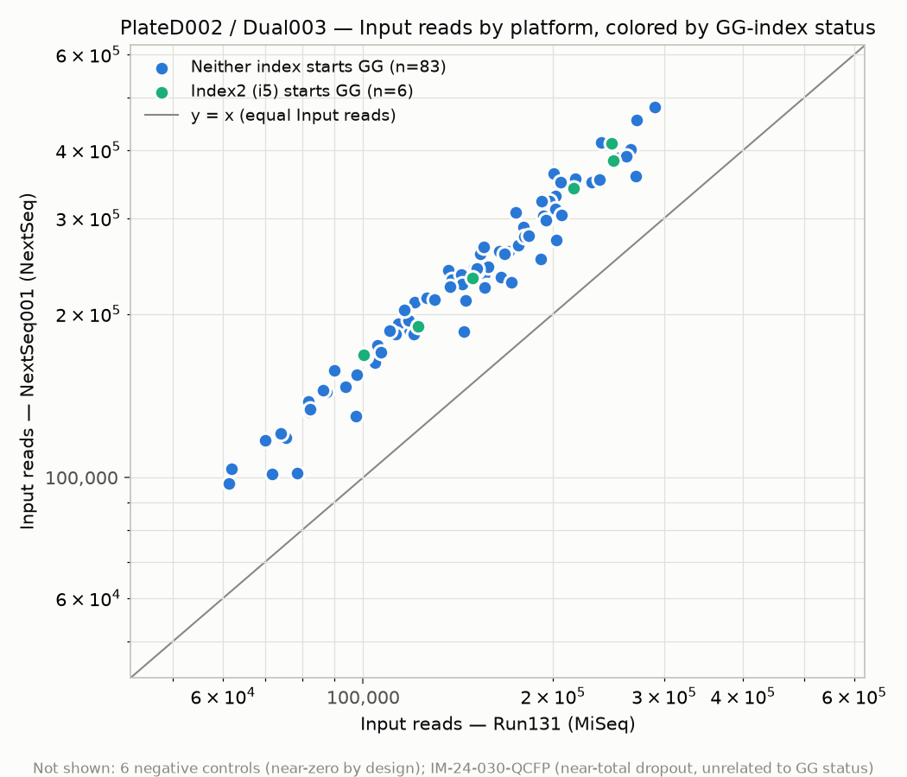

# GG-Index Performance Review — PlateD002 / Dual003

## Background & purpose

Paragon's bioinformatics team reviewed the index sequences for the 12
additional plates now being manufactured and identified **104 indexes**
that violate Illumina's requirement that index reads must not begin with
two "G" bases in the first two cycles. Per Illumina, a "GG"-leading index
generates no signal in cycles 1–2, which can cause failed demultiplexing or
a rejected run:

- https://knowledge.illumina.com/instrumentation/general/instrumentation-general-reference_material-list/000001241
- https://support-docs.illumina.com/IN/NextSeq_550-500/Content/IN/IndexingConsiderations_fNS_fMN.htm

Because these plates will ship as product, Paragon's QMS requires a risk
assessment. Illumina's own documentation classifies "GG"-leading indexes as
a risk. However, UCSF and collaborators have been using indexes with this
property in production for several years, so their run history is a
relevant source of real-world evidence on whether this risk has actually
materialized as a performance problem (low signal, cluster-registration
failures, repeated failed samples on specific index combinations).

This analysis is a first, narrow look at that evidence: one batch
(**PlateD002**, indexed with **Dual003**) that was run on both a MiSeq
(**Run131**, no GG problems reported) and a NextSeq (**NextSeq001**,
potential GG problem reported), compared sample-for-sample.

## Data

All source files are in [`data/`](data):

| File | Description |
|---|---|
| `PlateD002_CZB_Dual_Indexes.csv` | Index sheet for PlateD002/Dual003 — 96 samples (incl. controls), `Index` (i7) + `Index2` (i5), CZB TruSeq 12bp indexes. |
| `sample_coverage_Run131.txt` | Per-sample read counts by pipeline stage (`Input`, `No Dimers`, `Amplicons`, `OutputDada2`, `OutputPostprocessing`) for the MiSeq run. 144 samples in the file (this run pooled more than just PlateD002). |
| `sample_coverage_NextSeq001.txt` | Same schema, for the NextSeq run. 624 samples in the file. |

Derived outputs are in [`data/processed/`](data/processed):

- `plateD002_input_comparison.csv` — one row per matched sample: index
  sequences, GG category, `Input` reads on each platform, and the
  NextSeq/MiSeq fold-change.
- `summary_stats.csv` — n / mean / median / stdev of `Input` reads per GG
  category per platform, and the mean NextSeq/MiSeq ratio per group.

## Methodology

1. **GG classification.** For each sample in the index sheet, `Index` (i7)
   and `Index2` (i5) are each checked for a "GG" prefix, giving one of
   `Index1_GG`, `Index2_GG`, `Both`, or `Neither`.

   Within PlateD002/Dual003, **only Index2 (i5)** ever starts with "GG"
   (6/96 samples); **no sample's Index1 (i7)** does. So this dataset only
   lets us compare **"Index2 (i5) starts GG"** vs **"Neither"** — it cannot
   speak to i7-GG or double-GG cases.

2. **Sample matching across runs.** Coverage files suffix each sample name
   with `_S<number>` (NextSeq001) or `_S<number>_L001` (Run131). Stripping
   that suffix and matching against the index sheet's `Sample_ID` gives
   96/96 matches in NextSeq001 and 88/96 in Run131.

   The 8 unmatched samples are all controls: the 2 positive controls use a
   different lot ID between runs (`8073801003` in Run131 vs `8073801533` in
   NextSeq001), and the 6 negative controls aren't present in Run131's
   coverage file at all. **These 8 were excluded from the comparison** —
   88 real samples remain, matched in both runs.

3. **Metric.** `Reads` at `Stage == "Input"` — the earliest pipeline stage,
   i.e. reads successfully assigned to the sample by demultiplexing, before
   any dimer/amplicon filtering. This is the most direct readout of a
   demux / cluster-registration / signal problem, which is what the GG-index
   risk is about.

4. **One further exclusion.** Sample `IM-24-030-QCFP` (`Neither` category)
   has `Input = 1` read on **both** platforms — a near-total dropout
   unrelated to GG-index status (neither of its indexes starts GG). It's
   excluded from the plot and from the summary statistics below so it
   doesn't dominate the "Neither" group's mean/stdev, but it remains in
   `plateD002_input_comparison.csv` and in the table view of the chart.

Reproduce with:

```
pip install pandas matplotlib   # matplotlib only needed for the static PNG
python3 scripts/build_comparison.py     # writes data/processed/*.csv
python3 scripts/make_static_figure.py   # writes figures/*.png
python3 scripts/render_artifact.py      # writes figures/*.html
```

## Results

| GG category | n | Mean Input — Run131 (MiSeq) | Mean Input — NextSeq001 | Mean ratio (NextSeq / MiSeq) |
|---|---|---|---|---|
| Index2 (i5) starts GG | 5 | 186,983 | 298,614 | **1.60** |
| Neither | 82 | 153,422 | 241,470 | **1.58** |

(Full detail in `data/processed/summary_stats.csv`; per-sample values in
`data/processed/plateD002_input_comparison.csv`.)

The 5 individual `Index2 (i5) starts GG` samples behind that mean:

| Sample | Index2 (i5) primer sequence | Input — Run131 (MiSeq) | Input — NextSeq001 | Ratio (NextSeq / MiSeq) |
|---|---|---|---|---|
| IM-24-030-HLUN | `GGAATGAGTCGT` | 122,059 | 189,942 | 1.556 |
| IM-24-030-SBPN | `GGAGAATGCTTG` | 100,178 | 168,147 | 1.678 |
| IM-24-030-TMSA | `GGCTAAGAGAAC` | 249,034 | 382,420 | 1.536 |
| IM-24-030-ZCCV | `GGAAGAGACACT` | 247,820 | 412,307 | 1.664 |
| IM-24-044-DGQK | `GGTACTGACACT` | 215,822 | 340,252 | 1.577 |
| **Mean** | — | **186,983** | **298,614** | **1.597** |

All 5 ratios cluster tightly (1.54–1.68), matching the 82-sample `Neither`
group's mean ratio of 1.58 — no individual GG(i5) sample stands out as an
underperformer relative to the others.



**Interactive version** (hover for per-sample detail, toggle to a full
data table): see `figures/plateD002_gg_vs_neither.html`, or the version
published for this session:
https://claude.ai/code/artifact/b91f10a5-b492-44c0-bf9c-a2527649b0d9

### Reading the chart

- Both platforms give more `Input` reads on NextSeq than MiSeq for
  essentially every sample (all points sit above the y=x line) — expected,
  since NextSeq001 and Run131 are different runs with different total
  loading/depth, not a GG effect.
- The 5 `Index2 (i5) starts GG` samples (green) fall **inside the same
  cloud** as the 82 `Neither` samples (blue), not below it. Their mean
  NextSeq/MiSeq ratio (1.60) is essentially identical to — and if anything
  slightly higher than — the `Neither` group's (1.58).
- No sample in either group shows the signature of a demux/cluster-
  registration failure (near-zero `Input` reads) except the one excluded
  dropout, which is a `Neither`-category sample, not a GG one.

### Interpretation

**For this one batch/run pair, we see no evidence that an i5 index
starting with "GG" reduced Input-stage read yield on the NextSeq relative
to the MiSeq**, or relative to non-GG samples on the same NextSeq run.

This should be weighed against real limitations, not treated as a
clearance:

- **n = 5** GG samples is a very small group to draw a general conclusion
  from — a real but moderate effect could easily be invisible at this
  sample size.
- This plate has **no i7-GG or double-GG (`Both`) samples**, so this
  analysis is silent on those cases, which may behave differently (i7 is
  frequently the platform's primary/first-read index and can be more
  sensitive to a dark first two cycles depending on instrument and run
  recipe).
- Only **one plate** (PlateD002/Dual003) and **one MiSeq/NextSeq run
  pair** were examined. The other 11 flagged plates, and other
  instruments/run recipes in UCSF's history, are not yet covered.
- `Input` reads capture demux/cluster-registration success but not
  downstream data quality (e.g., elevated index-hopping or lower Q30 in
  cycles 1–2) — this analysis doesn't rule those out.

### Suggested next steps

- Repeat this comparison for the other plates/runs where GG-index samples
  exist, especially any with i7-GG or `Both` samples, to build up the n.
  before drawing a project-wide conclusion.
- Pull index-hopping / Q30-at-cycle-1-2 metrics if available, since low
  `Input`-read impact doesn't fully rule out the mechanism Illumina
  describes.
- If broader review continues to show no material impact, document that
  as the risk-assessment evidence base per QMS, alongside Illumina's
  published guidance and any compensating controls already in the
  workflow (e.g., higher spike-in / loading concentration).

## Repository layout

```
data/
  PlateD002_CZB_Dual_Indexes.csv          # index sheet (source)
  sample_coverage_Run131.txt              # MiSeq coverage (source)
  sample_coverage_NextSeq001.txt          # NextSeq coverage (source)
  processed/
    plateD002_input_comparison.csv        # per-sample merged table
    summary_stats.csv                     # per-group summary stats
scripts/
  build_comparison.py                     # builds data/processed/*.csv
  make_static_figure.py                   # builds the PNG in figures/
  render_artifact.py                      # builds the interactive HTML
figures/
  plateD002_gg_vs_neither_scatter.png
  plateD002_gg_vs_neither.html
```
